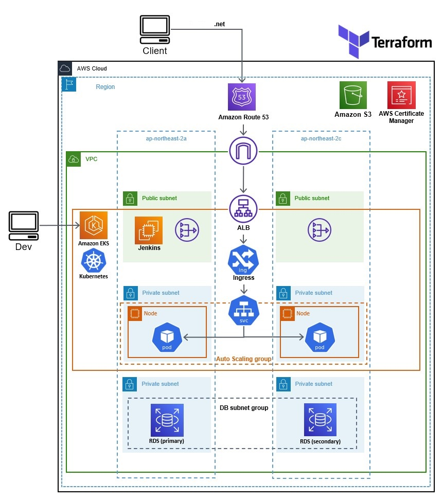
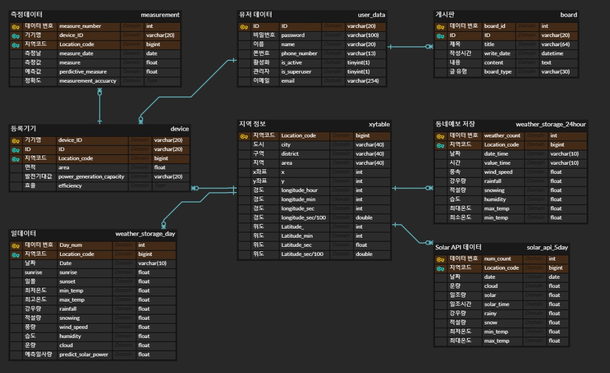

# ☀️ Solar A.I Predict System
기상 예보를 활용하여 일사량을 예측하고 태양광 패널의 발전량을 예측하여 제공하는 서비스입니다.

## 🌐 제공 웹페이지

## ☁️ [Service Architecture](https://github.com/xoodb/Solar-AI-Predict-Project/tree/main/terraform_file)

## 🛢 Database

## 🔁 CI/CD workflow

## 사용기술
### Language
- Python
- Terraform(AWS)

### Web
- Nginx (Web Server)
- Gunicorn (WSGI)
- Django (Application Server)

### DB
- MySQL

### CI/CD
- Jenkins
- Argocd

### Monitoring
- Prometheus
- Grafana

### Containerization
- Docker

Orchestration
- Kubernetes
